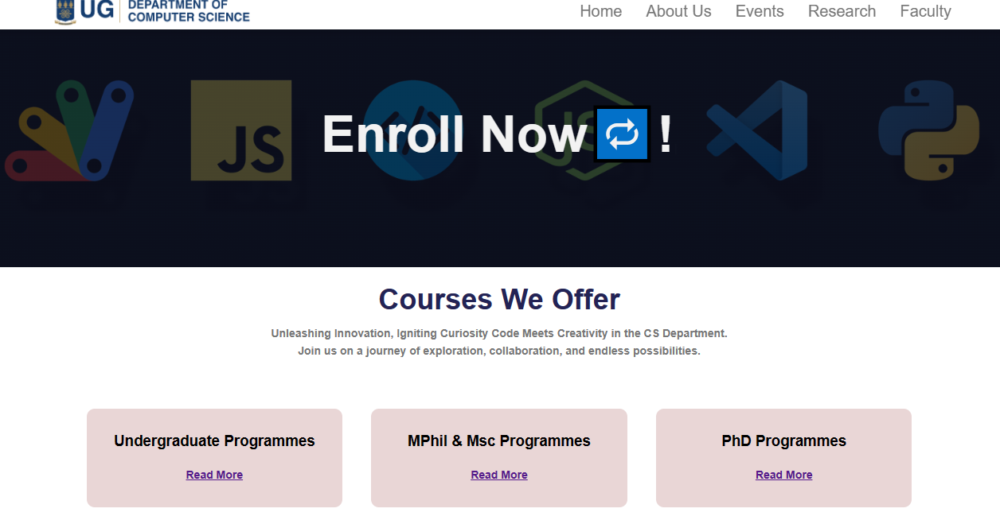

# DCIT_205_IA

## Department of Computer Science Website

## Introduction

This repository contains the source code for the Computer Science Department website project.

## Project Structure

- **`css/`**: Contains the styles for the website.
- **`js/`**: Houses JavaScript files..
- **`index.html`**: Main HTML file for the website and also for the homepage.
- **`about.html`**: Page dedicated to information about the department.
- **`events.html`**: Page dedicated to upcoming and past event about the department.
- **`registration.html`**: Page to register short courses at the department.
- **`research.html`**: Page related to research activities at the department.
- **`faculty.html`**: Page providing information about the faculty.
- **`undergrad.html`**:Page for undergraduate-related information.
- **`postgraduate.html`**: Page for postgraduate-related information.
- **`phd.html`**: Page for registering Ph.D. courses at the department.
- **`learnmore.html`**: Page for more info about the CS.
- **`images/`**: Directory containing images for website
- **`README.md`**: Documentation for the project.

## Getting Started

# Introduction

This website stands as a culmination of my interim assessment, representing a dynamic project aimed at bringing the Computer Science Department into the digital spotlight. Its core purpose is not only to showcase the department but also to immerse visitors in a rich experience encompassing diverse facets such as the catalog, resources, upcoming events, and essential contact information. Crafted with an emphasis on user engagement, seamless navigation, and the delivery of comprehensive information, this website aims to be a virtual hub for all things related to the Computer Science Department.

# Forking, Cloning, and Setting Up the Project

1. **Fork the Repository:**

   - Click on the "Fork" button in the top-right corner of the repository.
   - This will create a copy of the repository in your GitHub account.

2. **Copy the Repository URL:**

   - On your forked repository page (in your GitHub account), click on the green "Code" button and copy the repository URL.

3. **Open Terminal (or Command Prompt on Windows):**

   - Open a terminal or command prompt on your local machine.

4. **Navigate to the Directory Where You Want to Clone the Repository:**

5. **Run the `git clone` Command:**

6. **Press Enter:**

   - Press Enter to execute the command.

7. **Navigate into the Cloned Directory:**

8. **Explore Your Project:**

   - Now you have the project cloned to your local machine. You can explore the files and directories, make changes, and work on your project locally.

9. **Open in Your Code Editor:**

   - Open the project in your preferred code editor (e.g., Visual Studio Code, Sublime Text, Atom).

10. **View Your Website:**
    - To view your website locally, open the `index.html` file in your browser. You can also use a live server extension if you have one installed in your code editor.

That's it! You've successfully forked, cloned, and set up your project on your local machine.

## Creator 🧑‍💻

- **Name:** Bernard Asiedu Owusu-Dankwah
- **Student ID:** 11024002
- **GitHub:** https://github.com/bennydan7

## Recent Enhancements 🚀

- **Short Course Registration:**
  Incorporated a user-friendly form for seamless registration in our short courses.

- **Active Navbar Functionality:**
  Introduced dynamic highlighting to the navigation bar for a more intuitive and interactive user experience.

- **Slider Functionality and More:**
  Enhanced the website with dynamic slider functionality and various other improvements.

- **Automatic Typing Effect:**
  Added a captivating automatic typing effect to bring a dynamic and engaging element to the site. Dive in and explore the enhancements! 😎

# Website Preview

## Navigation Bar and Footer

## Home Page

## About Us

## Faculty

## Events Overview

## Short Courses Registration

<!-- ## Undergraduate Programs

## PhD Courses

 -->

# Key Takeaways From This Project

Throughout the development of this project, I've had the opportunity to enhance my skills and knowledge in several areas:

- **Web Development Fundamentals:**

  - Acquired a solid understanding of HTML, CSS, and JavaScript for building engaging and interactive websites.

- **Responsive Design Techniques:**

  - Implemented responsive design principles to ensure the website looks and functions seamlessly across various devices and screen sizes.

- **GitHub Collaboration:**

  - Learned effective collaboration workflows on GitHub, including forking, cloning, creating branches, committing changes, and submitting pull requests.

- **Research and Resource Integration:**

  - Developed skills in researching and integrating various computer science resources, enriching the content and functionality of the website.

- **User-Focused Design:**
  - Gained insights into creating a user-friendly and intuitive design to enhance the overall user experience.

I'm excited to have applied and expanded my knowledge in these areas throughout the development journey. This project has been a valuable learning experience, and I look forward to continuing to refine my skills in future projects.
